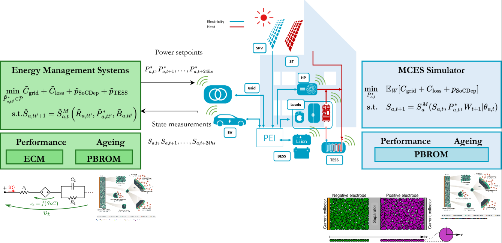
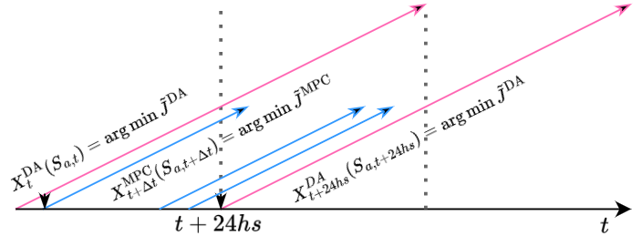

# DegMPC


**‘The aim of FLEXINet is a system that accelerates the energy transition. We hope to make a substantial contribution to reaching climate targets by cleverly combining various techniques – think of blending recycled batteries with flexible heat pumps and the charging of electric cars.’**

## Description
This repository contains the code for reproducing the Case Studies presented in [Ageing-aware](https://arxiv.org/abs/2503.16139). The code is based on the [EMSmodule](https://github.com/DarioSlaifsteinSk/EMSmodule) library, [JuMP.jl](https://jump.dev/) and [InfiniteOpt.jl](https://github.com/infiniteopt/InfiniteOpt.jl).




## Usage

First, clone this repository and `Pkg.instantiate()` to install the dependencies.

The functions to run the EMS are in the files:
```julia
runRollingHorizon.jl  # Script to run the Case Study 1: Residential MCES with different battery models and tunning weights.
runLFPvsNMC.jl  # Script to run the Case Study 2: Cathode Chemistry comparison
runFreshvsAged.jl  # Script to run the Case Study 3: Compare used and new batteries in a residential MCES.
runTermCondBESS.jl # Script to run the Appendix B: Compare different terminal conditions for the battery in a residential MCES.
```

The plotting and analysis is done in the files:
```julia
plotFigs_AppEnergyDA.jl  # Script to analyze and plot the results of Case Study 1
notebooks/CS1_benchmarks_AppEnergy.ipynb
notebooks/CS2_NMCvsLFP_AppEnergy.ipynb
notebooks/CS3_FreshvsAged_AppEnergy.ipynb
notebooks/makeElaadFits.ipynb # Fitting EV mobility distributions.
notebooks/makeLoadForecasts.ipynb # Fitting load forecasts.
notebooks/makePriceForecasts.ipynb # Fitting price forecasts.
```

Following the Universal Modelling Framework (UMF) this package implements Direct Lookahead (DLA) Policies. The DLA is a model-based policy that uses a model of the system to predict the future and optimize the control actions. The available DLAs are a day-ahead (DA) planner and a Model Predictive Controller (MPC). The basic algorithm is depicted in the following figure:



The DA planner uses a model of the system to predict the future and optimize the control actions for the next 24 hours. The MPC uses a model of the system to predict the future and optimize the control actions for the next 24 hours, but it also uses the actual measurements to update the model and the optimization problem every hour. The MPC is an economic non-linear MPC (NLP-eMPC) receding horizon controller.

The main function to run the sequential market operation is `rollingHorizon()` in the `runRollingHorizon.jl` file. This function implements the sequential operation of the DA and MPC policies. The DA policy is solved first, and its results are used to initialize the MPC policy. The MPC policy is then solved, and its results are used to update the system state. This process is repeated for the entire simulation horizon.

## Authors and acknowledgment

This repository contains the work produced for the [FLEXINET](https://www.tudelft.nl/en/eemcs/cooperation/flexinet) project by the [DCE&S group](https://www.tudelft.nl/en/eemcs/the-faculty/departments/electrical-sustainable-energy/dc-systems-energy-conversion-storage), Electrical Sustainable Energy Dept. of the TU Delft. The work belongs to Dario Slaifstein, Gautam Rituraj, and Joel Alpizar.

## License
MIT License

# References

Cite as:

```bibtex
@article{Slaifstein2026,
   author = {Darío Slaifstein and Gautham Ram Chandra Mouli and Laura Ramirez-Elizondo and Pavol Bauer},
   doi = {10.1016/J.APENERGY.2026.127402},
   issn = {0306-2619},
   journal = {Journal of Energy Storage},
   month = {4},
   pages = {127402},
   publisher = {Elsevier},
   title = {Ageing-aware Energy Management for Residential Multi-Carrier Energy Systems},
   volume = {408},
   url = {https://linkinghub.elsevier.com/retrieve/pii/S0306261926000541},
   year = {2026}
}
```